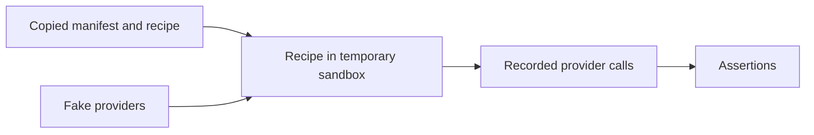

# Baseline acceptance test

> Documentation type: explanation. This page states what the sandboxed suite proves and what it does not prove.

`tests/acceptance/test_baseline.py` runs the public Windows PowerShell entry point in temporary directories. Fake provider commands record arguments. The suite does not install, remove, or query real packages.

## Test shape

The Windows fixture copies the PowerShell recipe and manifest. Provider stubs replace Scoop and Mise where applicable.

## Covered contract

| Area | Assertions |
| --- | --- |
| Manifest and public recipes | Valid manifest completes without provider calls. |
| List and dry run | List is manifest-only. Dry run names provider and bootstrap boundaries without side effects. |
| Status and provider matches | Uses selected-provider inventories, reports version matches where supported, and does not use `PATH` or cross-provider aliases. |
| Installation | Forwards custom and default raw IDs. It does not create a global Mise config or DevRecipe state record. |
| Uninstall | Prints a plan first, requires confirmation, preflights every requested entry, uses version-specific Mise removal, and rejects broad cleanup arguments. |
| Provider safety | Covers conservative Scoop and Mise removal commands. |
| Containers | Validates before the integrated bundle, displays side-effect-free plans, and verifies Podman arguments. |
| Preflight and review | Reports provider-managed state and conflict evidence without mutation, and rejects review before mutation without an interactive terminal. |

Run the suite with the [acceptance-checks how-to](../tests/acceptance/README.md).

## Limits

A green result proves the command contract against controlled stubs. It does not prove package availability, provider authentication, network access, enterprise policy, installation success, application behavior, or provider ownership. It does not provide rollback. Provider presence is status evidence only.
