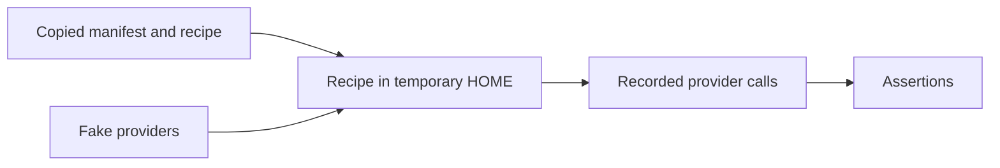

# Baseline acceptance test

> **Documentation type:** explanation. This page explains what the sandboxed test suite proves and what it intentionally does not prove.

`tests/acceptance/test_baseline.py` exercises the public Windows, macOS, and Linux entry points from temporary directories. It uses fake package-provider commands and records their arguments, so a test run does not install, remove, or query real packages.

## Test shape

The Unix fixture copies the standalone `DevRecipe_unix.bash` recipe and its selected manifest, then uses a test-only platform override. The Windows fixture copies the PowerShell recipe and manifest. Provider stubs replace Scoop, Homebrew, APT, Flatpak, Mise, and `sudo` where applicable.

## Covered contract

| Area | Assertions |
| --- | --- |
| Manifest and public recipes | Valid manifests complete without provider calls; the standalone Unix recipe supports both Unix manifests. |
| List and dry run | List is manifest-only; dry run names provider/bootstrap boundaries without side effects. |
| Status | Uses exact selected-provider inventory commands, not `PATH` or cross-provider aliases. |
| Installation | Forwards custom and default raw IDs; does not create a global Mise config or DevRecipe state record. |
| Uninstall | Prints a plan first, requires confirmation, preflights every requested entry, uses version-specific Mise removal, and rejects broad cleanup arguments. |
| Provider safety | Covers conservative APT, Flatpak, Scoop, Homebrew formula/cask, and Mise removal commands; verifies Mise removal before Homebrew `mise` removal. |
| Containers | Validates before the integrated bundle, displays side-effect-free plans on all hosts, and checks exact APT/Homebrew/Podman calls in the Unix sandbox. |
| Preflight and review | Reports selected-provider conflict evidence without mutation and rejects review before mutation when no interactive terminal exists. |

Run the suite with the [acceptance-checks how-to](../tests/acceptance/README.md).

## Limits

A green result proves the command contract against controlled stubs. It does not prove real package availability, provider authentication, network access, enterprise policy, actual installation success, application runtime behaviour, or provider ownership. It also does not promise rollback: provider presence is intentionally treated as status evidence only.
